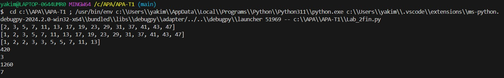

## Foto


## Código


```python
import numpy as np

def esPrimo(a):
    if(a == 0):
        return False
    for i in range(int(np.sqrt(a))):
        if(a%(i+1) == 0  and i+1 != 1 and i+1 != a ):
            return False
    return True 

print ([ numero for numero in range(2, 50) if esPrimo(numero) ])


# b = esPrimo()
# if (b):
#     print("es peimo")
# else:
#     print("no")

def primos(a):
    tupla = []
    for i in range(a+1):
        if (esPrimo(i)):
            tupla.append(i)
    return tupla
    

a = primos(50)
print(a)

def descompon(a):
    primos_posibles = primos(a)
    primos_reales = [1]
    i = 0
    if(esPrimo(a)):
        primos_reales.append(a)
    while( primos_posibles[i]!= primos_posibles[-1] ):   
        if(a % primos_posibles[i+1] == 0):
            a = a/primos_posibles[i+1]
            primos_reales.append(primos_posibles[i+1])
        else:
            i = i+1

    return primos_reales

c = descompon(36*175*143)  
print(c)

def mnm(numero1,numero2):
    minimo = 1
    primos_num1 = descompon(numero1)
    primos_num2 = descompon(numero2) 
    min = primos_num1 + primos_num2
    for i in range(len(min)):
        count1 = 0
        count2 = 0
        for k in range(len(primos_num1)):
            if(min[i] == primos_num1[k]):
                count1 = count1 + 1
                primos_num1[k] = 0
        for a in range(len(primos_num2)):
            if(min[i] == primos_num2[a]):
                count2 = count2 + 1
                primos_num2[a] = 0
        if(max(count1,count2) != 0):
            minimo = minimo * max(count1,count2) * min[i]
    return minimo

#k = descompon(13)  
#print(k)
#z = descompon(15) 
#print(z)
a = mnm(90, 14)
print(a)

    
def mdc(numero1,numero2):
    tupla = []
    primos_num1 = descompon(numero1)
    primos_num2 = descompon(numero2) 
    for i in range(len(primos_num1)):
        for a in range(len(primos_num2)):
            if (primos_num1[i] == primos_num2[a]):
                primos_num2[a] = 0
                tupla.append(primos_num1[i])
    return max(tupla)

 
#print(z)
a = mdc(924, 780)
print(a)


def mcmN(*numeros):
    maxim = max(numeros)
#    for numero in numeros:
#        if (i % numero != 0): break
#    else:
#        return i
    
    mult=1
    for numero in numeros:
        mult = mult*numero
    
    for j in range(maxim,mult+1):
        for numero in numeros:
            if (j%numero != 0):
                break
        else: break
        j += 1        
    return j

x = mcmN(42, 60, 70, 63)
print(x) 


def mcdN(*numeros):
    divisor = max(numeros)
    for numero in numeros:
        divisor = mdc(divisor, numero)
    return divisor

x = mcdN(840, 630, 1050, 1470)
print(x)
```